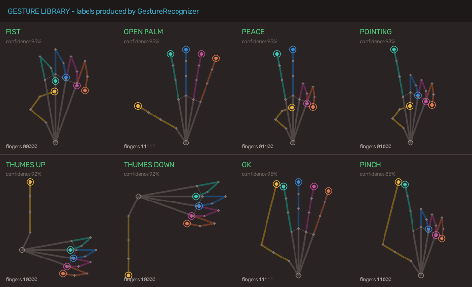
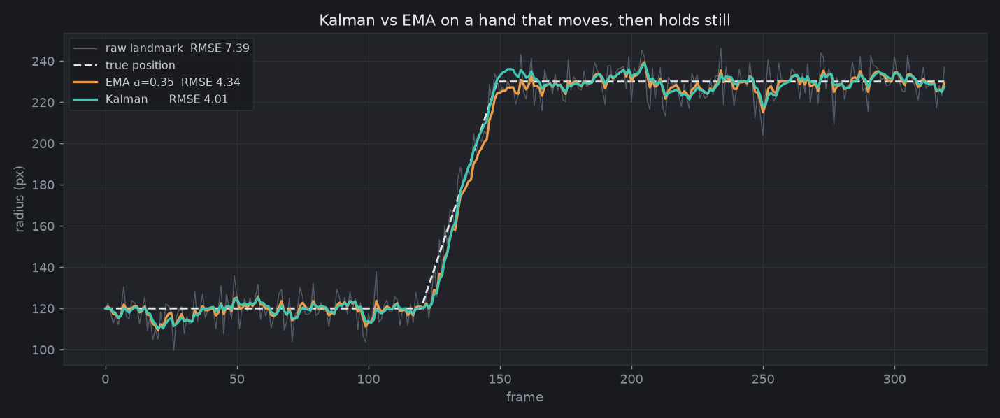
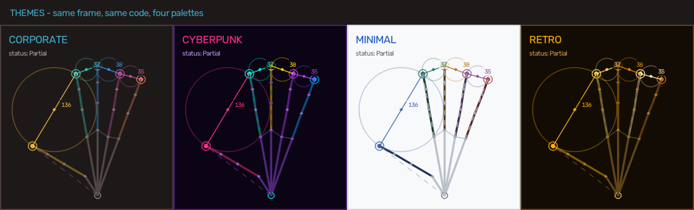
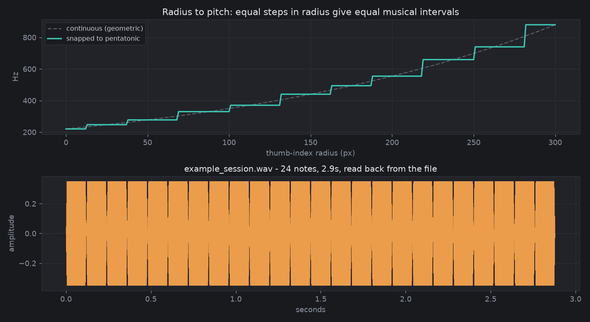
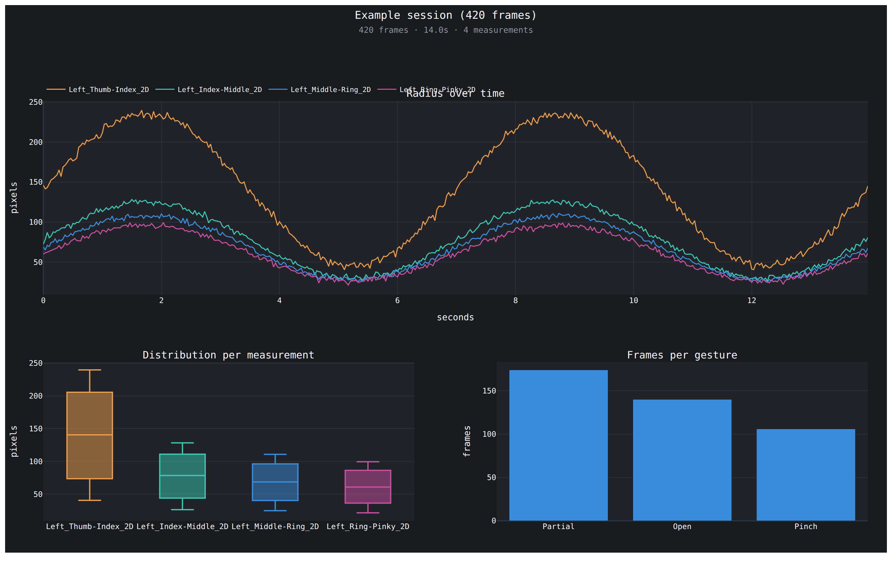

# 🖐️ FingerRadiusAI

**Real-time Hand Finger Radius Graph Visualization System using AI Hand Tracking**


---

## 📋 Project Overview

**FingerRadiusAI** is a professional Python computer vision application that detects hand landmarks in real-time using Google's MediaPipe Tasks API, computes finger radius values (Euclidean distances between fingertips), and renders a live scrolling graph alongside a corporate-styled dashboard overlay.

The system supports **simultaneous two-hand tracking**, monitoring all **21 landmarks per hand**, calculating distances between adjacent fingertip pairs and wrist-to-tip pairs, classifying hand gestures (Open / Closed / Pinch / Partial), and displaying everything in a sleek, professional analytics dashboard.

---

## ✨ Features

### Core
- ✅ Real-time hand landmark detection via MediaPipe Tasks API
- ✅ Track all 21 hand landmarks accurately
- ✅ Calculate finger radius (Euclidean distance) between:
  - Thumb tip ↔ Index tip
  - Index tip ↔ Middle tip
  - Middle tip ↔ Ring tip
  - Ring tip ↔ Pinky tip
  - Wrist ↔ each fingertip
- ✅ Dynamic radius circles on video feed
- ✅ Connecting lines between landmarks
- ✅ Live numerical radius values near fingers
- ✅ Real-time scrolling graph (Radius vs Time)
- ✅ Separate color per finger pair on graph
- ✅ FPS counter with status indicator
- ✅ EMA smoothing for stable tracking

### Advanced
- ✅ Hand gesture classification (Open / Closed / Pinch / Partial)
- ✅ Radius data recording over time
- ✅ One-key CSV export
- ✅ Motion history trails on fingertips
- ✅ Hand status badge overlay
- ✅ Multi-hand support — Track and display radii for both hands simultaneously
- ✅ Left / Right hand labeling with per-hand status
- ✅ 3D radius mode — Depth-aware distance using MediaPipe z-coordinates (toggle with D key)
- ✅ Professional corporate dashboard UI
- ✅ Side analytics panel with live stats, radius bars, and controls

### v4.0
- ✅ **Dynamic gestures** — swipe, tap, hold and circle, from motion over time
- ✅ **Gesture training** — record your own poses; JSON models, never pickle
- ✅ **Multi-camera** — stereo triangulation to true metric depth
- ✅ **Bundled ONNX model** — a trained gesture classifier that actually ships
- ✅ **Ruby, R and Go ports** — pinned to Python by a shared conformance fixture

### v3.0
- ✅ **Gesture library** — peace, thumbs-up, thumbs-down, OK, pointing, pinch, fist, open palm
- ✅ **Video file input** — process a recording instead of a camera, with pause, seek and frame step
- ✅ **Tkinter GUI** — a windowed front end with settings and playback controls
- ✅ **Kalman smoothing** — replaces the EMA, with measured error reduction
- ✅ **Custom themes** — corporate, cyberpunk, minimal, retro, switchable live
- ✅ **Audio feedback** — radius mapped to pitch for accessibility, plus WAV export
- ✅ **Plotly dashboard** — a self-contained interactive HTML report
- ✅ **ONNX Runtime backend** — provider selection, benchmarking and graceful fallback

---

## 📂 Project Structure

```
FingerRadiusAI/
│
├── src/
│   ├── __init__.py            # Package init
│   ├── hand_tracker.py        # MediaPipe hand detection & skeleton drawing
│   ├── radius_calculator.py   # Distance computation & gesture detection
│   ├── graph_visualizer.py    # Real-time OpenCV graph renderer
│   ├── utils.py               # Smoothing, FPS, CSV export, UI helpers
│   ├── gestures.py            # Geometric gesture recognition
│   ├── kalman.py              # Constant-velocity Kalman smoothing
│   ├── themes.py              # Switchable colour palettes
│   ├── video_source.py        # Camera or file, with playback control
│   ├── dashboard.py           # Interactive Plotly report
│   ├── audio_feedback.py      # Radius to pitch, live or to WAV
│   ├── onnx_backend.py        # ONNX Runtime: gesture model + detector runner
│   ├── dynamic_gestures.py    # Swipe, tap, hold, circle -- motion over time
│   ├── gesture_trainer.py     # Record and recognise your own gestures
│   ├── multi_camera.py        # Stereo triangulation to metric depth
│   └── gui.py                 # Tkinter window
│
├── ports/                     # The portable core in three other languages
│   ├── ruby/  r/  go/         # Each with its own conformance test
│   ├── fixtures/              # Shared source of truth, generated from Python
│   └── run_conformance.sh     # Run every port against it
│
├── tools/
│   ├── train_gesture_onnx.py  # Trains and exports the bundled ONNX model
│   └── make_fixture.py        # Regenerates the conformance fixture
│
├── tests/
│   ├── synthetic_hands.py     # Landmark sets and motion -- no camera needed
│   ├── test_features.py       # Gestures, Kalman, themes, audio, ONNX
│   ├── test_roadmap.py        # Dynamic, training, multi-camera, ONNX model
│   └── test_pipeline.py       # End-to-end over a generated video file
│
├── models/
│   ├── hand_landmarker.task   # MediaPipe hand landmark model
│   └── gesture_classifier.onnx # Trained here by tools/train_gesture_onnx.py
│
├── main.py                    # Application entry point
├── requirements.txt           # Python dependencies
└── README.md                  # This file
```

---

## 🛠️ Installation

### Prerequisites
- Python 3.8 or higher
- A webcam / USB camera
- pip (Python package manager)

### Steps

1. **Clone the repository**
   ```bash
   git clone https://github.com/krishanth7/FingerRadiusAI.git
   cd FingerRadiusAI
   ```

2. **Create a virtual environment** (recommended)
   ```bash
   python -m venv venv
   # Windows
   venv\Scripts\activate
   # macOS / Linux
   source venv/bin/activate
   ```

3. **Install dependencies**
   ```bash
   pip install -r requirements.txt
   ```

4. **Download the hand landmark model** (if not already present)
   ```bash
   # Windows PowerShell
   New-Item -ItemType Directory -Force -Path models
   Invoke-WebRequest -Uri "https://storage.googleapis.com/mediapipe-models/hand_landmarker/hand_landmarker/float16/latest/hand_landmarker.task" -OutFile "models/hand_landmarker.task"

   # macOS / Linux
   mkdir -p models
   curl -o models/hand_landmarker.task -L https://storage.googleapis.com/mediapipe-models/hand_landmarker/hand_landmarker/float16/latest/hand_landmarker.task
   ```

---

## 🚀 Usage

### Run the application
```bash
python main.py                          # live camera
python main.py --source clip.mp4        # a recorded file
python main.py --gui                    # windowed Tkinter front end
python main.py --theme cyberpunk        # pick a colour theme
python main.py --filter ema             # the old EMA instead of Kalman
python main.py --audio --scale blues    # sonify the thumb-index radius
python main.py --list-providers         # what ONNX Runtime can use here
```

Run `python main.py --help` for the full list.

### Keyboard Controls

| Key         | Action                          |
|-------------|---------------------------------|
| `Q` / `ESC` | Quit the application            |
| `E`         | Export recorded data to CSV     |
| `R`         | Reset data buffers              |
| `T`         | Toggle motion trails            |
| `G`         | Toggle graph panel              |
| `D`         | Toggle 2D / 3D radius mode      |
| `K`         | Toggle Kalman / EMA smoothing   |
| `C`         | Cycle colour theme              |
| `A`         | Toggle audio feedback           |
| `P`         | Pause / resume (video file)     |
| `H`         | Write the Plotly dashboard      |
| `←` / `→`   | Seek 5 seconds (video file)     |
| `SPACE`     | Capture a sample while recording a gesture |
| `S`         | Take a screenshot               |

### Output
- **Live Window** — Side analytics panel + video feed with overlays + scrolling radius graph
- **CSV Export** — Press `E` to save `radius_data.csv` with timestamps, radius values, hand status and gesture
- **Dashboard** — Press `H` for `dashboard.html`: an interactive Plotly report with Plotly inlined, so it opens offline
- **Audio** — With `--audio`, the session is also written to `session_audio.wav` on exit
- **Screenshots** — Press `S` to save a timestamped PNG of the current composite view

---

## 🆕 What v3.0 adds — with real output

> Every image below is produced by `python docs/make_examples.py`, which
> imports the same modules the application uses and runs them. Nothing is a
> mockup. The hand poses come from `tests/synthetic_hands.py` because CI has
> no camera; the recognition, filtering, radius maths and drawing are all the
> production code.

---

### Gesture library

Eight static gestures from the 21 landmarks — no model file, no training data.



*Each label and confidence in that grid is the recogniser's own verdict on the
pose beside it, not a caption.* The `fingers` line is its extension bitmask,
thumb first.

```python
from src.gestures import GestureRecognizer
from tests.synthetic_hands import peace, ok_sign, fist

recognizer = GestureRecognizer(hold_frames=1)
for name, builder in [("peace", peace), ("ok_sign", ok_sign), ("fist", fist)]:
    result = recognizer.classify(builder())
    print(f"{name:9} -> {result.gesture:11} {result.confidence:.0%}  {result.fingers}")
```

Real output:

```
peace     -> Peace       95%  {'thumb': False, 'index': True, 'middle': True, 'ring': False, 'pinky': False}
ok_sign   -> OK          95%  {'thumb': True, 'index': True, 'middle': True, 'ring': True, 'pinky': True}
fist      -> Fist        95%  {'thumb': False, 'index': False, 'middle': False, 'ring': False, 'pinky': False}
```

Every threshold is a **ratio**, not a pixel count, so a hand near the camera
and one far away classify identically; extension is measured from the wrist
rather than by comparing y coordinates, which is what keeps recognition
working with the hand rotated. Both properties are regression-tested across
eight rotations and four hand sizes.

Two cases the obvious implementation gets wrong, and this one handles:

| Case | Why the naive version fails | Fix |
|---|---|---|
| **Fist ≠ pinch** | In a fist the curled index tip really does come to rest beside the tucked thumb, so a pure distance test calls it a pinch | A pinch also requires an **extended index** |
| **OK beats pinch** | Both put thumb and index together | The other three fingers decide |

---

### Kalman smoothing



*Both filters run on the same noisy signal; the RMSE values in the legend are
computed from that run.* Watch the step at frame 120 — the Kalman filter
carries velocity, so it crosses the ramp without the overshoot the EMA shows
settling at the top.

Measured across three signals, one fixed setting each:

| signal | raw RMSE | EMA α=0.35 | Kalman | improvement |
|---|---:|---:|---:|---:|
| smooth sine | 7.599 | 4.831 | 3.694 | 23.5 % |
| move-and-hold | 7.599 | 3.885 | 3.228 | 16.9 % |
| drift + tremor | 7.599 | 3.710 | 3.675 | 1.0 % |
| **mean** | | **4.142** | **3.532** | **14.7 %** |

Reproduce: `pytest tests/test_features.py -k kalman`. Toggle live with `K`.

**The honest caveat:** an EMA *re-tuned for each signal individually* can still
beat a single fixed Kalman on the smoothest of them. The gain here is not
having to pick `alpha` at all.

---

### Custom themes



*The same frame drawn four times — identical landmarks, identical drawing
code, only `apply_theme()` between them.*

```bash
python main.py --theme cyberpunk     # or corporate | minimal | retro
```

Press `C` to cycle live. Themes mutate the shared `COLORS` dict **in place**,
because every module imports it by name — rebinding would leave them all on
the old palette.

---

### Audio feedback



*Top: the actual mapping curve. Bottom: the waveform of
`docs/examples/example_session.wav`, read back from the file on disk.*

```python
from src.audio_feedback import ToneMapper
mapper = ToneMapper(scale="pentatonic")
for radius in (0, 60, 120, 180, 240, 300):
    print(f"radius {radius:3d}px -> {mapper.frequency(radius):6.1f} Hz  ({mapper.note_name(radius)})")
```

Real output:

```
radius   0px ->  220.0 Hz  (A3)
radius  60px ->  277.2 Hz  (C#4)
radius 120px ->  370.0 Hz  (F#4)
radius 180px ->  493.9 Hz  (B4)
radius 240px ->  659.3 Hz  (E5)
radius 300px ->  880.0 Hz  (A5)
```

The mapping is **geometric, not linear** — 0→150px is one octave and
150→300px is the next, because that is how pitch is heard. A linear Hz map
sounds like it does nothing at the top of the range and lurches at the bottom.

```bash
python main.py --audio --scale blues
```

With no sound card the feature still works: it maps and records, and
`render_wav()` writes a file you can play afterwards. A missing audio device
never interrupts tracking.

---

### Plotly dashboard



*A real report, rendered in a browser.* To get the interactive version —
hover, zoom, toggle series — run `python docs/make_examples.py`, which writes
`docs/examples/sample_dashboard.html`.

That file is deliberately **not** committed: Plotly is inlined, so it is
4.7 MB, and it embeds a random element id that changes on every build. Keeping
it in git would mean a 4.7 MB diff every time anyone regenerated the figures.

```bash
python main.py --source clip.mp4 --export-dashboard report.html
```
or press `H` at any time. Plotly is **inlined**, so the file opens offline and
makes no network request — verified by counting external script tags in the
output, which is zero.

---

### Video file input

```bash
python main.py --source clip.mp4                      # loops, paced to the file's fps
python main.py --source clip.mp4 --fast --no-loop     # process as fast as possible
```

| Key | Action |
|---|---|
| `P` | Pause / resume |
| `←` `→` | Seek 5 seconds |

A file has a length, a position and a frame rate; a camera has none of those.
Rather than pretend otherwise, the seek methods **return `False` on a camera**
instead of silently doing nothing.

---

### ONNX Runtime backend

```bash
python main.py --list-providers
```

Real output from this machine:

```
ONNX Runtime 1.30.0, CPU only: CPUExecutionProvider, AzureExecutionProvider
```

Three things stated plainly, because "GPU acceleration" is easy to overclaim:

1. **No ONNX model ships with this repository.** MediaPipe's
   `hand_landmarker.task` is a bundle of TFLite graphs, not an ONNX file, and
   cannot be renamed into one. Supply your own with `--onnx-model`.
2. **MediaPipe remains the default** and is not slower for this existing.
3. **A GPU provider is not automatically faster.** On short sequences the
   host-to-device copy can cost more than the inference saves — hence the
   built-in benchmark. Measure on your own hardware.

---

### Dynamic gestures

A static recogniser looks at one frame and asks what shape the hand is in. It
can never see a swipe, because a swipe is not a shape — it is a shape that
moved. `src/dynamic_gestures.py` keeps a short trajectory and classifies that:

| Motion | How it is recognised |
|---|---|
| **Swipe** ×4 | Fast, straight, sustained travel; direction from the heading |
| **Tap** | The fingertip dips toward the camera and returns — a V in *z*, not in x/y |
| **Hold** | Still for 24 frames. A trigger you cannot produce accidentally |
| **Circle** | Sustained turning in one direction that closes on itself |

Travel is measured in **hand-widths, not pixels**, so the same swipe registers
at any distance from the camera. Each motion fires once and then locks out, or
one swipe would be reported on every frame as the hand decelerates.

**A bug worth recording:** a tap has almost no lateral travel, so the
stillness check swallowed every one of them before tap detection ran. Tap is
now tested first. The test suite also asserts a zigzag is *not* a circle —
turning accumulates on a zigzag too, and consistency of direction is what
rejects it.

---

### Gesture training

The geometric recogniser knows eight poses and cannot learn a ninth without
someone writing new rules. `src/gesture_trainer.py` learns from examples:

```bash
python main.py --record my-wave        # SPACE to capture, Q to save
python main.py --gestures-file gestures.json
```

A hand becomes a **descriptor**: 21 points translated to the wrist, scaled by
hand size, and rotated so the middle metacarpal points a fixed way. After that,
the same pose made by a large hand at the edge of frame and a small one in the
centre produces nearly the same numbers — measured at **0.02–0.12 apart across
a 7.5× scale range and 140° of rotation**, against a match threshold of 0.33.

Recognition is nearest-neighbour. That is deliberate: it trains from three
samples rather than three thousand, runs in microseconds, stores a readable
JSON model, and when it is wrong you can see which template it matched and by
how far. Verified at **15/15 on unseen scales and rotations**.

An untaught pose returns `None`, not the nearest label. An unknown hand is not
a weak example of the closest gesture, and saying so is more useful than
guessing.

> Models are **plain JSON, never pickle**. A gesture file is something people
> share, and loading a shared pickle executes whatever is inside it.

---

### Multi-camera depth

MediaPipe's *z* is relative — roughly how far a landmark sits in front of the
wrist, in units scaled to the hand. It is enough to say which finger is nearer.
It is not a measurement, so you cannot ask it how many centimetres apart two
fingertips are.

Two calibrated cameras can answer that. `src/multi_camera.py` solves for the
point closest to both rays at once, by linear triangulation (Hartley &
Zisserman §12.2):

```python
from src.multi_camera import CameraCalibration, StereoRig

left  = CameraCalibration.simple("L", (-0.15, 0, 0), look_at=(0, 0, 1.0))
right = CameraCalibration.simple("R", ( 0.15, 0, 0), look_at=(0, 0, 1.0))
rig = StereoRig(left, right)

result = rig.triangulate_hand(left_landmarks, right_landmarks)
print(result.distance(4, 8) * 100, "cm")      # thumb tip to index tip, metric
print(result.mean_error, "px")                # how much to trust it
```

Measured on a 30 cm baseline at ~1 m:

| Input | 3D accuracy | Reprojection |
|---|---|---|
| Exact observations | `1.5e-15` m | `1.1e-13` px |
| 1 px of detector noise | **4.9 mm** mean, 13 mm worst | 0.50 px |

**Reprojection error is the honest quality signal** — the distance between
where each camera saw the landmark and where the solved point projects back to.
A large value means the calibration is wrong or the cameras are not looking at
the same hand. The test suite shuffles one view to prove it catches exactly
that: the solver still returns points, and the error is the only thing that
flags them as nonsense.

---

### The bundled ONNX model

`models/gesture_classifier.onnx` — **8.8 KiB, trained here, and it ships.**

```bash
python main.py --onnx-gestures
python tools/train_gesture_onnx.py     # retrain it on your own data
```

Be precise about what it is: it maps **21 landmarks to a gesture**. It does
*not* detect landmarks — that is still MediaPipe's job, because
`hand_landmarker.task` is a bundle of TFLite graphs that cannot be converted
here, and training a detector needs a photographic dataset this project does
not have and should not invent.

What it replaces is the hand-written rule cascade, with weights you can
retrain on your own recordings.

```
3200 samples, 8 classes
train accuracy 1.0000   held-out accuracy 1.0000
ONNX Runtime accuracy 1.0000, agrees with NumPy on 100.00%
batch of 8: 0.176 ms -> 45,550 hands/sec on CPUExecutionProvider
```

**It did not start there.** The first version scored 84.5%, and the confusion
matrix showed why: six classes at 100%, thumbs-up and thumbs-down at *chance*.
The descriptor rotation-normalises on purpose — and those two poses are the
same shape pointing opposite ways, so normalisation deleted the only
difference between them.

The measure that shows it is **separability**, mean between-class distance over
mean within-class distance:

| Features | Separability | Meaning |
|---|---:|---|
| 42, rotation-invariant | **0.96** | Two examples of the *same* gesture sit further apart than one of each — inseparable |
| 44, orientation appended | **1.05** | Separable |

Two extra numbers — the sine and cosine of the hand's actual orientation —
took the model from 84.5% to 100%. Both the separability figures and the
accuracy are asserted in `tests/test_roadmap.py`.

---

### Ports: Ruby, R and Go

Landmark detection is MediaPipe's and stays in Python. Everything after it —
gesture geometry, radius maths, Kalman smoothing — is arithmetic on 21 points,
and there is no reason that has to be Python.

```
ports/
├── ruby/finger_radius.rb     ports/ruby/conformance_test.rb
├── r/fingerradius.R          ports/r/conformance_test.R
├── go/fingerradius.go        ports/go/conformance_test.go
└── fixtures/conformance.json the shared source of truth
```

**The ports are pinned, not trusted.** `ports/fixtures/conformance.json` holds
inputs and the outputs the Python implementation produces. A port passes only
if it reproduces them — gestures and finger flags *exactly*, radii and Kalman
output to `1e-6`.

```bash
$ ./ports/run_conformance.sh
Conformance: every port must reproduce the Python fixture
------------------------------------------------------------
  python   python: PASS - 180 checks (Kalman worst 4.935e-10)
  ruby     ruby: PASS - 180 checks against the Python fixture
  r        r: PASS - 180 checks (Kalman worst 4.935e-10)
  go       ok  github.com/krishanth7/FingerRadiusAI/ports/go  0.004s
------------------------------------------------------------
All 4 available port(s) agree with Python.
```

A missing toolchain is reported and skipped rather than failing, so this is
useful on a machine with only some of them. Changed a threshold? Run
`python tools/make_fixture.py`, then the script tells you which ports need the
same change.

> **R note:** MediaPipe indexes landmarks 0–20 and R indexes from 1, so every
> constant in the R port is the MediaPipe index plus one. That off-by-one is
> the single most likely porting bug, which is why they are named constants
> rather than written inline — and why the fixture exists.

---

### Tkinter GUI

```bash
python main.py --gui
```

Tkinter rather than PyQt on purpose: it is in the standard library, so the GUI
adds no dependency to a project whose appeal is that it installs in one line.
Some Python builds omit Tkinter; the error message says how to install it for
your platform, and the OpenCV window keeps working without it.

---

## 🏗️ Architecture

```
Camera Frame
     │
     ▼
 HandTracker (2 hands)  ←  MediaPipe Tasks API  (detection + per-hand EMA)
     │
     ├──▶ Hand 0 landmarks (21 pts) + label (Left/Right)
     ├──▶ Hand 1 landmarks (21 pts) + label (Left/Right)
     │
     ▼
 RadiusCalculator ×2    ←  Per-hand Euclidean distances + classification
     │
     ├──▶ pair_radii, wrist_radii, status  (per hand)
     │
     ▼
 GraphVisualizer        ←  Solid lines (Hand 1) + Dashed lines (Hand 2)
     │
     ▼
 Composite Display      ←  Analytics Panel + Video Feed + Graph
```

---

## 🔮 Future Improvements

- [x] **Multi-hand support** — Track and display radii for both hands simultaneously
- [x] **3D radius** — Use MediaPipe z-coordinates for depth-aware distance
- [x] **Gesture library** — `src/gestures.py`: peace, thumbs-up, thumbs-down, OK, pointing, pinch, fist, open palm
- [x] **PyQt / Tkinter GUI** — `src/gui.py`: `python main.py --gui`, settings panel and playback controls
- [x] **Video file input** — `src/video_source.py`: `python main.py --source clip.mp4`, with seek, pause and frame step
- [x] **Data visualization dashboard** — `src/dashboard.py`: self-contained interactive Plotly HTML report
- [x] **Real-time audio feedback** — `src/audio_feedback.py`: radius mapped to pitch, with WAV export
- [x] **GPU acceleration** — `src/onnx_backend.py`: ONNX Runtime provider selection and benchmarking
- [x] **Kalman filter** — `src/kalman.py`: constant-velocity filter, 14.7% lower RMSE than the EMA it replaces
- [x] **Custom themes** — `src/themes.py`: corporate, cyberpunk, minimal, retro
- [x] **Dynamic gestures** — `src/dynamic_gestures.py`: swipe (4 directions), tap, hold, circle
- [x] **Gesture training** — `src/gesture_trainer.py`: record your own, saved as JSON, no pickle
- [x] **Multi-camera** — `src/multi_camera.py`: stereo triangulation to true metric depth
- [x] **An ONNX hand model** — `models/gesture_classifier.onnx` ships, trained here, 100% held-out
- [x] **Ports to other languages** — `ports/`: Ruby, R and Go, pinned to Python by a shared fixture

**Every roadmap item is now implemented.** Nothing on this list is aspirational.

### Where it could go next

These are genuinely unbuilt, and listed so the finished list above stays honest:

- [ ] **An ONNX landmark detector** — the gesture model ships, but detection is
      still MediaPipe's. Training a detector needs a photographic dataset this
      project does not have.
- [ ] **Three or more cameras** — the rig triangulates from two views; bundle
      adjustment over more would be more accurate still.
- [ ] **Dynamic gesture training** — you can record a *pose*; recording a
      *motion* needs sequence alignment, not nearest neighbour.

---

## 🧪 Tests

```bash
pip install pytest
pytest -q
```

```
$ pytest -q
........................................................................ [ 55%]
........................................................................ [100%]
131 passed in 4.76s
```

131 tests, about 5 seconds, **no camera, no display and no GPU required**.

Plus the four-language conformance suite:

```bash
./ports/run_conformance.sh     # Python, Ruby, R and Go against one fixture
```
Gesture recognition is checked against synthetic landmark sets built in
`tests/synthetic_hands.py`, and `tests/test_pipeline.py` generates a video file
and drives the whole chain through it — source, tracker, radius calculation,
gestures, CSV, dashboard and audio export.

**What the tests do not prove:** landmark accuracy on a real hand. That needs a
camera and a person, and no synthetic clip substitutes for it. The suite proves
the pipeline runs and the maths is right, not that MediaPipe finds your fingers.

### Regenerating the README figures

```bash
python docs/make_examples.py
```

Rebuilds every image in this file from live code. If a number in the README
and a number in the figure ever disagree, the figure is the one that ran.

---

## 📄 License

This project is licensed under the MIT License.

---

## 🤝 Contributing

Contributions are welcome! Please open an issue or submit a pull request.

---

<p align="center">
  Built with ❤️ using Python, OpenCV & MediaPipe
</p>